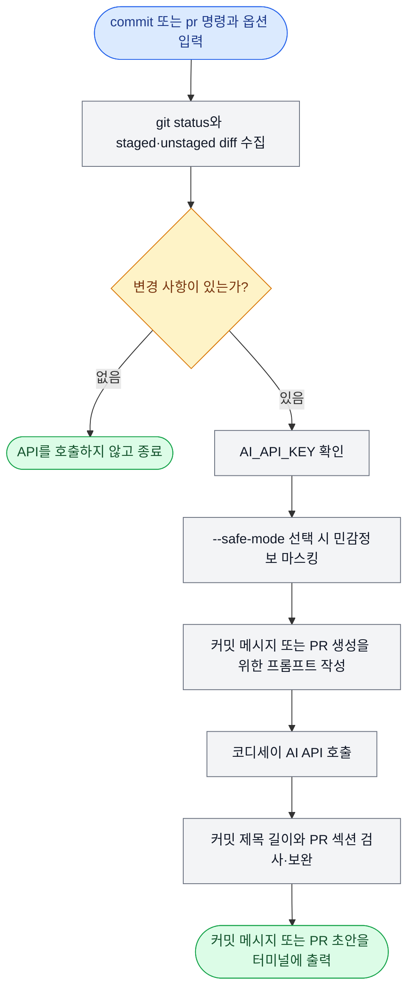

# AI 기반 Git 커밋/PR 자동 생성기

## 프로젝트 소개

Git 저장소의 `git status`, `git diff`, `git diff --cached`를 수집해 코디세이 기관
AI API에 전달하고, 변경 내용에 맞는 커밋 메시지 또는 Pull Request(PR) 초안을 생성하는 Python CLI
도구입니다. 기관 API는 OpenAI 호환 Chat Completions 형식을 사용합니다.

생성 결과는 Git이나 GitHub에 자동 반영하지 않고 터미널에 초안으로 출력합니다.
사용자는 내용을 검토한 뒤 직접 커밋 메시지나 PR 작성에 사용합니다.

## 주요 기능

| 구분 | 주요 기능 |
|---|---|
| Git 변경 수집 | unstaged 및 staged 변경 파일과 diff를 모두 수집 |
| `commit` 명령 | 변경 내용을 바탕으로 커밋 제목 한 줄 생성 |
| `pr` 명령 | PR 제목과 `Why`, `What`, `How to Test` 본문 생성 |
| CLI 옵션 | 모델, temperature, 최대 토큰 수를 실행 명령에서 설정 |
| 결과 검증 | 커밋·PR 제목 길이와 PR 필수 섹션·불릿 형식 검사 |
| Safe mode | API Key, 인증값, 이메일 등 알려진 민감정보 패턴을 마스킹한 뒤 전송 |
| 예외 처리 | 변경 없음, Key 누락, 인증·네트워크 오류를 구분해 안내 |
| 결과 출력 | 생성 결과를 자동 적용하지 않고 검토 가능한 초안으로 출력 |

## 사용 흐름

사용자 명령이 커밋 메시지 또는 PR 초안으로 출력되는 과정을 간단히 나타냅니다.



출력된 내용은 Git이나 GitHub에 자동 반영되지 않습니다.

프로그램의 내부 구조와 세부 처리 과정은 다음 문서를 참고하세요.

- [상세 실행 흐름](docs/design/execution-flow.md): 명령 실행부터 종료까지의 처리 순서와 분기
- [모듈 구성과 역할](docs/design/architecture.md): 파일별 책임, 데이터 경계, 구현 범위
- [함수 호출 관계](docs/design/function-call-flow.md): 함수가 호출되는 관계와 각 함수의 역할

## 프로젝트 구조

```text
.
├── .env.example
├── .gitignore
├── README.md
├── main.py                   # CLI 실행 순서와 진입점
├── gitgen/
│   ├── ai.py                 # AI API 요청과 응답 처리
│   ├── cli.py                # 명령행 옵션
│   ├── config.py             # API Key 설정
│   ├── errors.py             # 기능별 오류 타입
│   ├── gitctx.py             # Git 변경 수집
│   ├── postprocess.py        # 생성 결과의 길이와 형식 검증
│   ├── prompts.py            # commit/pr 프롬프트
│   ├── render.py             # 터미널 출력
│   └── sanitizer.py          # safe-mode 마스킹
├── requirements.txt         # Python 패키지 의존성
├── docs/
│   ├── design/
│   │   ├── architecture.md       # 구성도와 모듈별 책임
│   │   ├── execution-flow.md     # 상세 실행 흐름
│   │   └── function-call-flow.md # 함수 호출 관계
│   └── guides/
│       ├── ai-parameter-comparison.md # AI 파라미터별 실제 출력 비교
│       └── troubleshooting.md         # 오류 상황별 해결 방법
└── tests/
    ├── test_ai_api.py        # 기능별 API 요청과 오류 처리 테스트
    └── test_integration.py   # 실제 임시 Git 저장소 기반 통합 테스트
```

## 실행 환경

- Python 3.10 이상
- 코디세이 API 콘솔에서 발급한 활성 Key
- `python-dotenv 1.2.3`

필요한 패키지는 `requirements.txt`로 설치합니다. API는 코디세이 문서의 OpenAI
호환 규격을 따릅니다.

- API Base URL: `https://copa.codyssey.kr`
- 엔드포인트: `/v1/chat/completions`
- 기본 모델: `gpt-5.4-mini`
- 기본 temperature: `0.2`
- 기본 최대 토큰 수: `300`

## 설치 및 설정

1. 이 저장소를 내려받고 프로젝트 디렉터리로 이동합니다.
2. `python3 --version`으로 Python 3.10 이상인지 확인합니다.
3. 가상환경을 만들고 필요한 패키지를 설치합니다.

```bash
python3 -m venv .venv
source .venv/bin/activate
python3 -m pip install -r requirements.txt
```

4. 예시 파일을 복사해 `.env`를 만들고 기관에서 발급받은 Key를 입력합니다.

```bash
cp .env.example .env
```

`.env` 파일 내용:

```dotenv
AI_API_KEY=YOUR_API_KEY
```

프로그램은 프로젝트 루트의 `.env`를 자동으로 읽습니다. 이미 터미널에
`AI_API_KEY`가 설정되어 있으면 터미널 값이 `.env`보다 우선합니다.

`.env`와 `.venv/`는 `.gitignore`에 등록되어 있습니다. `.env.example`에는 실제
API Key를 입력하지 않습니다.

## 사용 방법

프로젝트 루트에서 실행합니다. 프로그램은 Git 변경 사항을 수집하고, 선택한 결과를
생성하기 위해 코디세이 기관 API를 한 번 호출합니다.

### 커밋 메시지 생성

```bash
python3 main.py commit
```

변경 내용을 반영한 커밋 제목 한 줄을 생성합니다.

### PR 초안 생성

```bash
python3 main.py pr
```

PR 제목과 `Why`, `What`, `How to Test` 구조를 갖춘 본문을 생성합니다.

### 변경 사항이 없는 경우

`git status`, `git diff`, `git diff --cached`에서 변경 사항을 찾지 못하면 두 명령
모두 생성 작업을 진행하지 않고 종료 코드 0으로 끝납니다.

```text
[INFO] 실행 명령: <commit 또는 pr>
[INFO] 변경 사항이 없습니다. 생성을 진행하지 않고 종료합니다.
[INFO] AI API 호출 횟수: 0회
```

변경 사항이 없는 경우에는 API Key를 확인하지 않습니다.

### API Key가 없는 경우

변경 사항이 있는데 `AI_API_KEY`가 없거나 공백뿐이면 종료 코드 1로 끝납니다.
Key 값 자체는 어떤 경우에도 출력하지 않습니다.

```text
[ERROR] AI_API_KEY 환경변수가 설정되지 않았습니다.
[INFO] AI API 호출 횟수: 0회
```

### 종료 코드

| 코드 | 의미 |
|---|---|
| `0` | 생성 성공 또는 변경 사항 없음 |
| `1` | Git 명령, API Key 설정, AI API 요청·응답 오류 |
| `2` | 잘못된 명령이나 옵션 입력 |

### 문제 해결

API Key 입력과 인증, 기관 API 엔드포인트, Git 저장소 및 diff, 네트워크 오류에 대한 진단 방법은
[트러블슈팅 가이드](docs/guides/troubleshooting.md)를 참고하세요.

### AI API 파라미터 지정

```bash
python3 main.py commit \
  --model MODEL_NAME \
  --temperature 0.2 \
  --max-tokens 500 \
  --safe-mode
```

세 옵션은 `commit`과 `pr` 명령에서 동일하게 사용할 수 있습니다. 옵션을 생략하면
기본값이 적용됩니다.

| 옵션 | 용도 | 기본값 |
|---|---|---|
| `--model` | 사용할 AI 모델 선택 | `gpt-5.4-mini` |
| `--temperature` | 생성 결과의 무작위성 조절(0~2) | `0.2` |
| `--max-tokens` | 생성 응답의 최대 토큰 수 제한(1 이상) | `300` |
| `--safe-mode` | AI에 보내기 전 알려진 민감정보 패턴 마스킹 | 사용하지 않음 |

`--model`에는 기관 API가 지원하는 비어 있지 않은 모델 이름을 입력해야 합니다.

값을 하나씩 바꾸어 실제 출력 차이를 확인한 결과는
[AI API 파라미터 비교](docs/guides/ai-parameter-comparison.md)를 참고하세요.

### Safe mode

`commit`과 `pr`에서 동일하게 사용할 수 있습니다.

```bash
python3 main.py commit --safe-mode
python3 main.py pr --safe-mode
```

Safe mode를 사용하면 변경 파일명과 Git diff에서 다음 패턴을 찾아 치환한 뒤
터미널에 표시하고 AI 프롬프트에 전달합니다.

| 마스킹 대상 | 치환 값 |
|---|---|
| `API_KEY`, `api-key`, `access_token`, `token`, `secret`, `password` 할당값 | `[MASKED_SECRET]` |
| `Bearer` 인증값 | `[MASKED_TOKEN]` |
| `sk-`로 시작하는 API Key | `[MASKED_API_KEY]` |
| 이메일 주소 | `[MASKED_EMAIL]` |

Safe mode를 적용하면 다음과 같이 처리됩니다.

| 대상 | 처리 방식 |
|---|---|
| AI API 프롬프트 | 변경 파일명과 diff의 민감정보 패턴을 마스킹 |
| 터미널 출력 | 마스킹 건수를 표시하고, `Changed Files`와 `Git Diff`에도 마스킹된 내용을 표시 |

> **주의:** Safe mode는 알려진 패턴만 탐지합니다. 실행 전에 `git diff`를 직접
> 확인하세요. 탐지되지 않은 민감정보는 AI 전송 내용과 터미널 출력에 남을 수 있습니다.

옵션을 생략하면 원본 변경 파일명과 diff를 AI API로 전송합니다.

## 생성 결과 형식

진행 로그와 Git 변경 내용 다음에 생성 결과가 별도 영역으로 출력됩니다.

### 커밋 메시지

```text
--- Commit Message ---
<변경 내용을 반영한 커밋 제목>
----------------------
```

현재는 최소 요구사항에 따라 제목 한 줄만 생성합니다. 50자를 넘으면 권장 길이 경고를
표시하고, 최대 72자를 넘으면 말줄임표를 포함한 72자 이내로 줄입니다.

### PR 초안

```text
--- PR Title ---
<변경 내용을 반영한 PR 제목>

--- PR Body ---
## Why
- <변경 배경>

## What
- <핵심 변경 사항>

## How to Test
- <검증 방법>
----------------------
```

PR 초안에는 다음 규칙이 적용됩니다.

- 제목은 최대 80자이며, 초과하면 자동으로 줄입니다.
- 본문에는 `Why`, `What`, `How to Test` 섹션이 필요합니다.
- 각 섹션에는 최소 한 개의 불릿이 필요합니다.
- 섹션이나 내용이 없으면 `- 사용자 확인 필요`를 추가합니다.
- 불릿 없이 작성된 내용은 불릿 형식으로 바꿉니다.

자동 보완이 발생하면 최종 결과 전에 `[WARN]` 메시지가 표시됩니다.

## 사용 시 주의사항

### 민감정보

- 변경 파일 목록과 diff는 코디세이 기관 API로 전송됩니다. 실행 전에 `git diff`와
  `git diff --cached`를 확인하세요.
- Safe mode는 알려진 패턴을 AI 전송 내용과 터미널 출력에 동일하게 마스킹합니다.
  자세한 내용은 [Safe mode](#safe-mode)를 참고하세요.

### Git 수집 범위

- `git diff`의 unstaged 변경과 `git diff --cached`의 staged 변경을 모두 수집합니다.
- 아직 추적하지 않는 파일은 변경 파일 목록에만 표시되며 파일 내용은 포함되지
  않습니다.

### API 사용

- 변경 사항이 있을 때만 실행하는 것을 권장합니다.
- `commit`과 `pr`은 명령 한 번당 API를 한 번 호출하며, 횟수는 실행 로그에
  표시됩니다.

### 생성 결과 적용

- 생성된 문구는 초안이므로 사용자가 검토한 뒤 적용해야 합니다.
- 이 도구는 `git push`나 GitHub PR 생성을 자동으로 수행하지 않습니다.

## 정상 동작 확인

### 자동 테스트

실제 API 요청을 준비된 가짜 응답으로 대신해, API Key나 토큰을 사용하지 않고 주요
기능과 오류 처리를 확인합니다. 실제 API 연결은 아래의 `실제 API 확인` 절차로
검증합니다.

```bash
python3 -m unittest discover -s tests -v
```

성공하면 마지막에 `OK`가 표시됩니다.

### 실제 API 확인

추적 중인 파일을 수정하고 `.env`에 유효한 Key를 설정한 뒤 다음 중 하나를 실행합니다.
각 명령은 기관 API를 한 번 호출합니다.

```bash
python3 main.py commit
python3 main.py pr
```

정상이라면 Git 수집과 API 요청 로그 뒤에 `[DONE]`이 표시되고, 각각
`Commit Message` 또는 `PR Title`·`PR Body` 영역이 출력됩니다. CLI 옵션은 다음
명령으로 확인할 수 있습니다.

```bash
python3 main.py --help
python3 main.py commit --help
```
