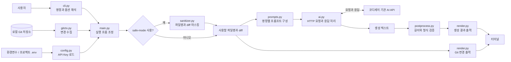
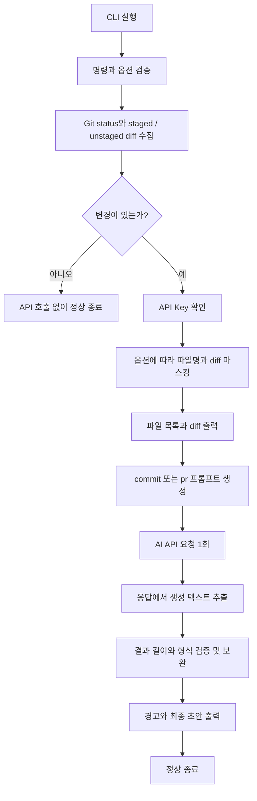

# AI 기반 Git 커밋/PR 자동 생성기 아키텍처

## 개요

이 문서는 현재 구현된 Python CLI의 구성 요소와 데이터 흐름을 설명한다.
프로그램은 로컬 Git 저장소의 변경 내용을 수집하고 코디세이 기관 AI API에
전달하여 커밋 제목 또는 PR 초안을 터미널에 출력한다.

전체 처리는 하나의 프로세스에서 순차적으로 실행된다. `main.py`가 실행 순서를
연결하고, `gitgen/`의 모듈이 Git 수집, 설정, 프롬프트, API 통신, 마스킹,
결과 검증과 출력을 담당한다. 데이터베이스나 별도 서버는 사용하지 않는다.

## 전체 구성도

아래 화살표는 주요 데이터 흐름을 나타낸다.



API Key는 `main.py`에서 `ai.py`로 전달되어 인증 헤더에 사용된다.
파일명과 diff를 구성하는 프롬프트 데이터와는 별도로 전달한다.
생성 결과를 검토하고 실제 커밋이나 PR에 적용하는 단계는 사용자가 수행한다.

## 파일별 책임

경로는 프로젝트 루트를 기준으로 한다.

| 파일 | 책임 | 주요 함수 또는 타입 |
|---|---|---|
| [main.py](../../main.py) | 구성 요소를 연결하고 실행 순서, 종료 코드, API 호출 횟수 로그를 관리한다. | `main()` |
| [gitgen/cli.py](../../gitgen/cli.py) | `commit`, `pr` 명령과 공통 옵션을 정의하고 옵션 값을 검증한다. | `create_parser()` |
| [gitgen/config.py](../../gitgen/config.py) | 프로젝트 `.env`와 환경변수에서 API Key를 읽는다. | `get_api_key()` |
| [gitgen/gitctx.py](../../gitgen/gitctx.py) | Git 명령을 실행하여 변경 파일 목록과 diff를 수집한다. | `collect_git_changes()` |
| [gitgen/sanitizer.py](../../gitgen/sanitizer.py) | 파일명과 diff에서 알려진 민감정보 패턴을 마스킹한다. | `mask_changes_for_safe_mode()` |
| [gitgen/prompts.py](../../gitgen/prompts.py) | 변경 내용을 명령별 생성 규칙과 결합해 프롬프트를 만든다. | `build_commit_prompt()`, `build_pr_prompt()` |
| [gitgen/ai.py](../../gitgen/ai.py) | API 요청을 보내고 응답 텍스트 추출 및 통신 오류 변환을 담당한다. | `call_ai_api()` |
| [gitgen/postprocess.py](../../gitgen/postprocess.py) | 생성된 제목의 길이와 PR 본문 구조를 검사하고 보완한다. | `validate_commit_message()`, `validate_pr_draft()` |
| [gitgen/render.py](../../gitgen/render.py) | Git 변경을 표시하고 후처리 함수를 호출하여 결과와 경고를 출력한다. | `print_git_changes()`, `print_commit_result()`, `print_pr_result()` |
| [gitgen/errors.py](../../gitgen/errors.py) | Git, 설정, API 오류를 구분하는 예외 타입을 정의한다. | `GitCommandError`, `ConfigurationError`, `AIAPIError` |

`main.py`에는 여러 모듈의 함수를 가져오는 import도 있지만 실제 기능 구현은
각 모듈에 있다. 결과 검증은 현재 `render.py`가 `postprocess.py`를 호출하는 구조다.

## 실행 흐름



1. `argparse`가 명령과 옵션을 해석한다. 모델명은 비어 있으면 안 되고,
   temperature는 0~2, 최대 출력 토큰 수는 1 이상의 정수여야 한다.
2. `git status --short`, `git diff`, `git diff --cached`를 실행한다.
   합친 diff에는 staged 내용을 먼저, unstaged 내용을 나중에 넣고 각각의 구분을 표시한다.
3. 파일 목록이 비어 있고 diff도 공백뿐이면 API Key를 확인하지 않고 종료한다.
4. 변경이 있으면 API Key를 읽는다. 이미 설정된 환경변수가 `.env`보다 우선한다.
5. `--safe-mode`가 켜져 있으면 파일명과 diff를 마스킹한다.
   같은 처리 결과를 터미널의 변경 미리보기와 AI 프롬프트에 사용한다.
6. 선택한 명령의 프롬프트를 구성하여 API를 한 번 호출한다.
7. 생성 텍스트를 후처리하고 초안을 출력한다. 형식 보완에는 추가 API 호출이 없다.

## 데이터와 외부 시스템 경계

| 경계 | 전달 내용 | 처리 방식 |
|---|---|---|
| Git → `gitctx.py` | status 출력, unstaged diff, staged diff | `subprocess.run()`으로 Git CLI를 실행한다. |
| `gitctx.py` → `main.py` | `tuple[list[str], str]` | 변경 파일명 목록과 합친 diff 문자열을 반환한다. |
| `sanitizer.py` → `main.py` | `tuple[list[str], str, int]` | 마스킹된 파일명, diff, 치환 횟수를 반환한다. |
| `prompts.py` → `ai.py` | 프롬프트 문자열 | 생성 규칙, 변경 파일 목록, diff를 포함한다. |
| `ai.py` → 기관 API | HTTP POST JSON과 인증 헤더 | `urllib.request`로 동기 요청을 보낸다. |
| 기관 API → `ai.py` | Chat Completions 형식 JSON | `choices[].message.content`의 비어 있지 않은 문자열을 합친다. |
| 후처리 → 출력 | 제목, PR 본문, 경고 목록 | `render.py`가 구분선과 로그를 붙여 출력한다. |

현재 코드의 API 주소는 `https://copa.codyssey.kr/v1/chat/completions`이며,
요청 본문에는 `model`, `messages`, `temperature`, `max_tokens`, `stream: false`가
들어간다. 기본값은 `gitgen/ai.py`가 정의하고 CLI 옵션으로 모델, temperature,
최대 출력 토큰 수를 바꿀 수 있다. HTTP 요청 타임아웃은 30초이며 자동 재시도는 없다.

Git 명령은 프로그램을 실행한 현재 작업 디렉터리를 기준으로 동작한다.
반면 `.env`는 `gitgen/config.py`의 위치로 계산한 프로젝트 루트에서 읽는다.
따라서 분석 대상 Git 저장소의 위치와 설정 파일을 읽는 기준은 다르다.

## 결과 검증과 오류 처리

### 결과 검증

- 커밋 결과는 첫 줄을 제목으로 사용한다. 50자 초과 시 권장 길이 경고를 표시하고,
  72자 초과 시 말줄임표를 포함하여 72자 이내로 줄인다.
- PR 결과는 첫 줄을 제목으로, 나머지를 본문으로 나눈다. 제목은 80자 이내로 줄인다.
- PR 본문은 `Why`, `What`, `How to Test` 순서로 재구성한다.
  각 섹션의 내용을 불릿으로 정리하고, 비어 있으면 `- 사용자 확인 필요`를 넣는다.
- 후처리는 길이와 형식을 검사한다. 생성 문구의 사실 여부나 제안된 테스트의
  실제 실행 여부를 확인하는 기능은 없다.

### 종료와 오류

| 상황 | 처리 위치 | 종료 코드 | API 요청 시도 |
|---|---|---|---|
| 정상 생성 | `main.py` | 0 | 1회 |
| 변경 없음 | `main.py` | 0 | 0회 |
| 명령 또는 옵션 오류 | `cli.py` / `argparse` | 2 | 0회 |
| Git 실행 실패 | `gitctx.py` → `GitCommandError` | 1 | 0회 |
| API Key 누락 또는 공백 | `config.py` → `ConfigurationError` | 1 | 0회 |
| 인증·HTTP·네트워크 오류 | `ai.py` → `AIAPIError` | 1 | 1회 |
| JSON 해석 실패 또는 생성 텍스트 없음 | `ai.py` → `AIAPIError` | 1 | 1회 |

위 표는 코드에서 처리하는 주요 오류 경로다. `main.py`는 기능별 예외를 받아
오류 메시지를 표준 오류로 출력한다. 호출 횟수는 API 요청 직전에 증가하므로
성공 응답 횟수가 아니라 요청 시도 횟수를 나타낸다.

## 구현 범위와 제약

- 작업 트리와 인덱스의 변경을 수집한다. 브랜치 간 비교나 커밋 이력 기반의
  PR 범위 계산은 구현되어 있지 않다.
- untracked 파일은 status에 나타난 경로만 포함하고 파일 내용은 읽지 않는다.
- diff 크기 제한, 입력 토큰 예산 계산, 큰 변경의 분할 요약은 없다.
  `--max-tokens`는 출력 토큰 수를 제한하는 옵션이다.
- Safe mode는 기본적으로 꺼져 있다. 켜면 알려진 비밀값 할당, Bearer 토큰,
  `sk-` 형태의 키, 이메일 패턴을 마스킹하지만 모든 민감정보를 탐지하지는 못한다.
- Safe mode의 처리 대상은 입력 파일명과 diff다. AI 응답과 API 오류 메시지에
  별도로 마스킹을 적용하는 단계는 없다.
- 생성 결과의 파일 저장, Git 커밋, push, GitHub PR 생성은 구현되어 있지 않다.

## 검증 구조

[tests/test_ai_api.py](../../tests/test_ai_api.py)는 설정 우선순위, 요청 파라미터,
응답과 오류 처리, CLI 옵션, 프롬프트, 결과 후처리, Safe mode를 검증한다.
[tests/test_integration.py](../../tests/test_integration.py)는 임시 Git 저장소에서
실제 변경을 만들고 CLI의 전체 연결 흐름과 종료 조건을 검증한다.
두 테스트 파일 모두 외부 API 통신은 가짜 응답으로 대체한다.

프로젝트 루트에서 다음 명령으로 실행한다.

```bash
python3 -m unittest discover -s tests -v
```

실제 기관 API의 인증 및 연결과 생성 초안의 적절성은 **사용자 확인 필요** 항목이다.
실행 방법은 [README](../../README.md), 오류 진단은
[트러블슈팅 가이드](../guides/troubleshooting.md)를 참고한다.
