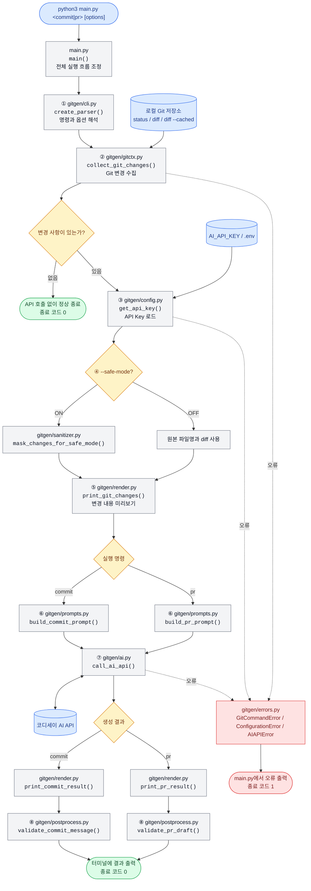

# 상세 실행 흐름

CLI 명령 실행부터 Git 변경 수집, AI API 호출, 결과 검증과 종료까지의 흐름을 나타낸다.

```mermaid
flowchart TB
    Start(["python3 main.py &lt;commit|pr&gt; [options]"])
    Main["main.py<br/><code>main()</code><br/>전체 실행 흐름 조정"]
    CLI["① gitgen/cli.py<br/><code>create_parser()</code><br/>명령과 옵션 해석"]
    GitCtx["② gitgen/gitctx.py<br/><code>collect_git_changes()</code><br/>Git 변경 수집"]
    Repo[("로컬 Git 저장소<br/>status / diff / diff --cached")]
    HasChanges{"변경 사항이 있는가?"}
    NoChanges(["API 호출 없이 정상 종료<br/>종료 코드 0"])
    Config["③ gitgen/config.py<br/><code>get_api_key()</code><br/>API Key 로드"]
    Env[("AI_API_KEY / .env")]
    SafeMode{"④ --safe-mode?"}
    Sanitize["gitgen/sanitizer.py<br/><code>mask_changes_for_safe_mode()</code>"]
    Original["원본 파일명과 diff 사용"]
    Preview["⑤ gitgen/render.py<br/><code>print_git_changes()</code><br/>변경 내용 미리보기"]
    Command{"실행 명령"}
    CommitPrompt["⑥ gitgen/prompts.py<br/><code>build_commit_prompt()</code>"]
    PRPrompt["⑥ gitgen/prompts.py<br/><code>build_pr_prompt()</code>"]
    AI["⑦ gitgen/ai.py<br/><code>call_ai_api()</code>"]
    API[("코디세이 AI API")]
    ResultType{"생성 결과"}
    CommitRender["gitgen/render.py<br/><code>print_commit_result()</code>"]
    PRRender["gitgen/render.py<br/><code>print_pr_result()</code>"]
    CommitValidate["⑧ gitgen/postprocess.py<br/><code>validate_commit_message()</code>"]
    PRValidate["⑧ gitgen/postprocess.py<br/><code>validate_pr_draft()</code>"]
    Success(["터미널에 결과 출력<br/>종료 코드 0"])
    Errors["gitgen/errors.py<br/>GitCommandError / ConfigurationError / AIAPIError"]
    Failure(["main.py에서 오류 출력<br/>종료 코드 1"])

    Start --> Main --> CLI --> GitCtx --> HasChanges
    Repo --> GitCtx
    HasChanges -->|없음| NoChanges
    HasChanges -->|있음| Config --> SafeMode
    Env --> Config
    SafeMode -->|ON| Sanitize --> Preview
    SafeMode -->|OFF| Original --> Preview
    Preview --> Command
    Command -->|commit| CommitPrompt --> AI
    Command -->|pr| PRPrompt --> AI
    AI <--> API
    AI --> ResultType
    ResultType -->|commit| CommitRender --> CommitValidate --> Success
    ResultType -->|pr| PRRender --> PRValidate --> Success

    GitCtx -. 오류 .-> Errors
    Config -. 오류 .-> Errors
    AI -. 오류 .-> Errors
    Errors --> Failure

    classDef input fill:#DBEAFE,stroke:#2563EB,color:#1E3A8A
    classDef process fill:#F3F4F6,stroke:#6B7280,color:#111827
    classDef decision fill:#FEF3C7,stroke:#D97706,color:#78350F
    classDef success fill:#DCFCE7,stroke:#16A34A,color:#14532D
    classDef failure fill:#FEE2E2,stroke:#DC2626,color:#7F1D1D

    class Start,Repo,Env,API input
    class Main,CLI,GitCtx,Config,Sanitize,Original,Preview,CommitPrompt,PRPrompt,AI,CommitRender,PRRender,CommitValidate,PRValidate process
    class HasChanges,SafeMode,Command,ResultType decision
    class NoChanges,Success success
    class Errors,Failure failure
```

함수 단위의 세부 연결은 [함수 호출 관계](function-call-flow.md)를 참고한다.
