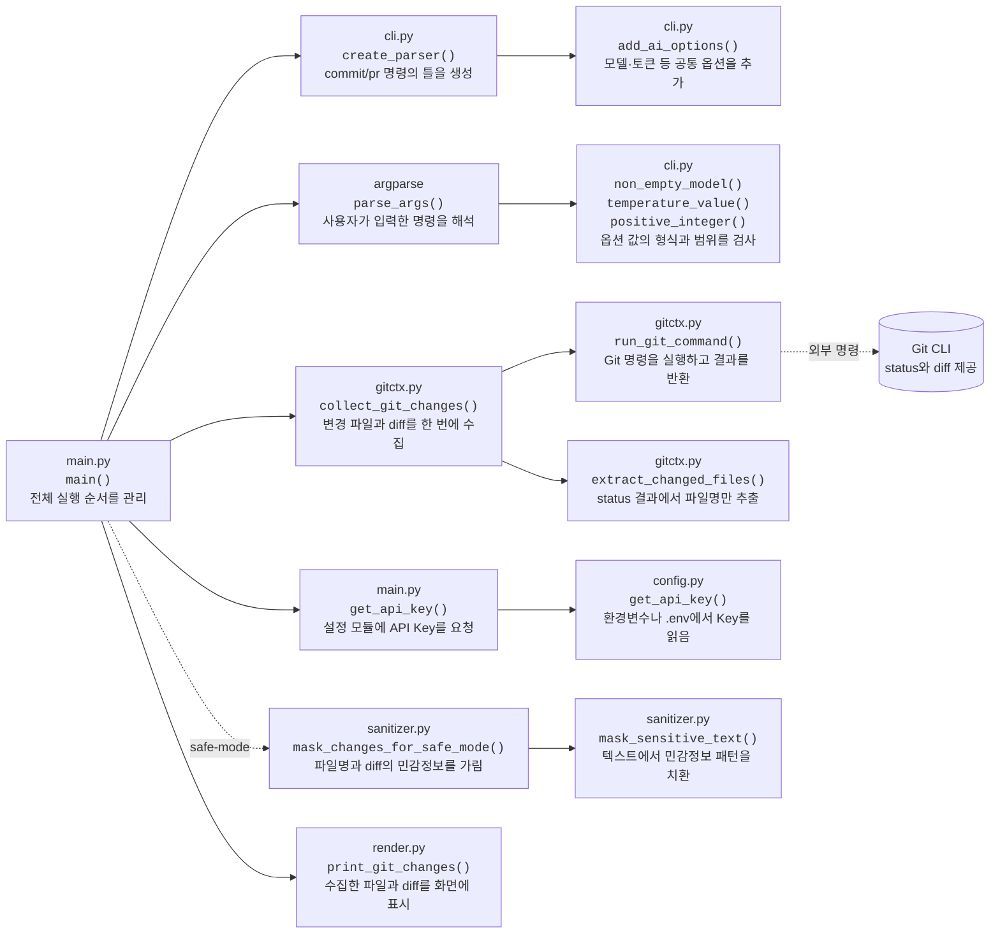
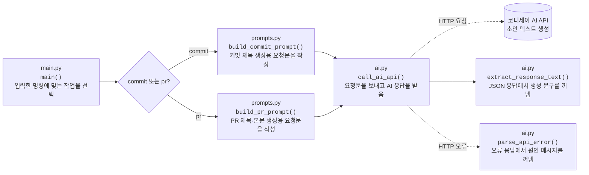
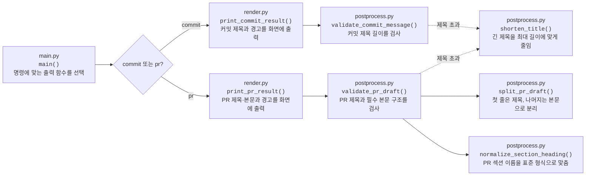

# 함수 호출 관계

함수 호출 관계를 입력 준비, AI 생성, 결과 처리의 세 영역으로 나누어 나타낸다.

다이어그램은 다음과 같이 읽는다.

- 박스는 위에서부터 `파일`, `함수`, `함수가 하는 일`을 표시한다.
- 실선 화살표는 한 함수가 다른 함수를 호출하는 관계다.
- 점선 화살표는 특정 조건에서만 호출하거나 외부 프로그램·API를 사용하는 관계다.

예를 들어 `main()` → `collect_git_changes()`는 `main()`이 Git 변경 사항을 얻기 위해
`collect_git_changes()`를 실행한다는 뜻이다.

## 1. 입력 준비

## 2. AI 생성

## 3. 결과 처리

실행 순서와 종료 분기는 [상세 실행 흐름](execution-flow.md)을 참고한다.

## 4. 전체 함수 호출 관계

아래 다이어그램은 앞에서 나눈 세 영역의 호출 관계를 한 번에 보여 준다.

```mermaid
flowchart TB
    Main["main.py<br/><code>main()</code>"]

    CreateParser["gitgen/cli.py<br/><code>create_parser()</code>"]
    ParseArgs["argparse.ArgumentParser<br/><code>parse_args()</code>"]
    AddOptions["<code>add_ai_options()</code>"]
    Validators["argparse 검증 함수<br/><code>non_empty_model()</code><br/><code>temperature_value()</code><br/><code>positive_integer()</code>"]

    Collect["gitgen/gitctx.py<br/><code>collect_git_changes()</code>"]
    RunGit["<code>run_git_command()</code>"]
    ExtractFiles["<code>extract_changed_files()</code>"]
    Git[("Git CLI")]

    MainKey["main.py<br/><code>get_api_key()</code>"]
    ConfigKey["gitgen/config.py<br/><code>get_api_key()</code>"]

    MaskChanges["gitgen/sanitizer.py<br/><code>mask_changes_for_safe_mode()</code>"]
    MaskText["<code>mask_sensitive_text()</code>"]

    PrintChanges["gitgen/render.py<br/><code>print_git_changes()</code>"]
    CommitPrompt["gitgen/prompts.py<br/><code>build_commit_prompt()</code>"]
    PRPrompt["gitgen/prompts.py<br/><code>build_pr_prompt()</code>"]

    CallAI["gitgen/ai.py<br/><code>call_ai_api()</code>"]
    ExtractResponse["<code>extract_response_text()</code>"]
    ParseError["<code>parse_api_error()</code>"]
    API[("코디세이 AI API")]

    PrintCommit["gitgen/render.py<br/><code>print_commit_result()</code>"]
    PrintPR["gitgen/render.py<br/><code>print_pr_result()</code>"]
    ValidateCommit["gitgen/postprocess.py<br/><code>validate_commit_message()</code>"]
    ValidatePR["gitgen/postprocess.py<br/><code>validate_pr_draft()</code>"]
    SplitPR["<code>split_pr_draft()</code>"]
    NormalizeHeading["<code>normalize_section_heading()</code>"]
    ShortenTitle["<code>shorten_title()</code>"]

    Main --> CreateParser
    Main --> ParseArgs
    CreateParser --> AddOptions
    CreateParser -. parser 구성 .-> ParseArgs
    ParseArgs --> Validators

    Main --> Collect
    Collect --> RunGit
    Collect --> ExtractFiles
    RunGit -. 외부 명령 .-> Git

    Main --> MainKey --> ConfigKey
    Main -. safe-mode일 때 .-> MaskChanges --> MaskText
    Main --> PrintChanges

    Main -->|commit| CommitPrompt
    Main -->|pr| PRPrompt
    Main --> CallAI
    CallAI --> ExtractResponse
    CallAI -. HTTP 오류일 때 .-> ParseError
    CallAI -. HTTP 요청 .-> API

    Main -->|commit| PrintCommit --> ValidateCommit
    Main -->|pr| PrintPR --> ValidatePR
    ValidateCommit -. 제목 초과 시 .-> ShortenTitle
    ValidatePR --> SplitPR
    ValidatePR --> NormalizeHeading
    ValidatePR -. 제목 초과 시 .-> ShortenTitle
```

