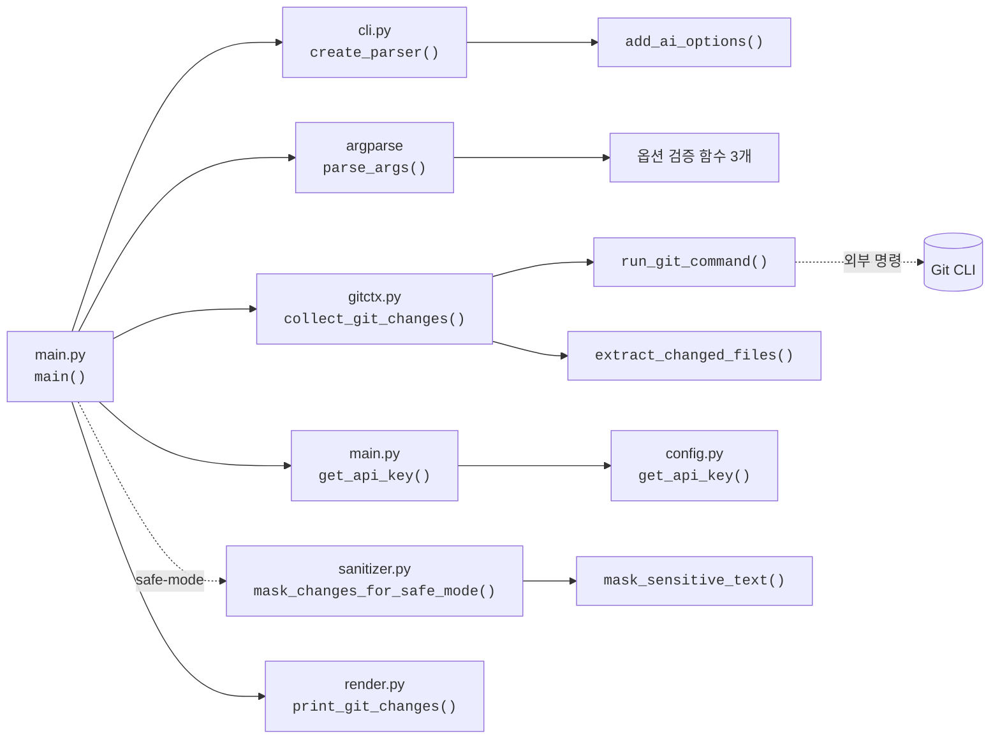
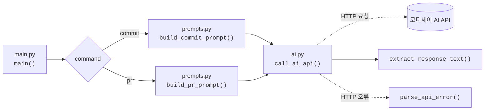
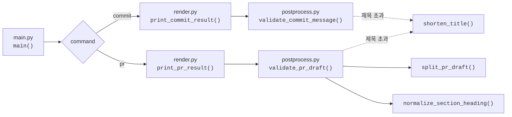

# 함수 호출 관계

함수 호출 관계를 입력 준비, AI 생성, 결과 처리의 세 영역으로 나누어 나타낸다.

## 1. 입력 준비

```mermaid
flowchart LR
    Main["main.py<br/><code>main()</code>"]

    Main --> Parser["cli.py<br/><code>create_parser()</code>"]
    Parser --> Options["<code>add_ai_options()</code>"]
    Main --> ParseArgs["argparse<br/><code>parse_args()</code>"]
    ParseArgs --> Validators["옵션 검증 함수 3개"]

    Main --> Collect["gitctx.py<br/><code>collect_git_changes()</code>"]
    Collect --> RunGit["<code>run_git_command()</code>"]
    Collect --> Extract["<code>extract_changed_files()</code>"]
    RunGit -. 외부 명령 .-> Git[("Git CLI")]

    Main --> MainKey["main.py<br/><code>get_api_key()</code>"]
    MainKey --> ConfigKey["config.py<br/><code>get_api_key()</code>"]

    Main -. safe-mode .-> Mask["sanitizer.py<br/><code>mask_changes_for_safe_mode()</code>"]
    Mask --> MaskText["<code>mask_sensitive_text()</code>"]
    Main --> Preview["render.py<br/><code>print_git_changes()</code>"]
```

## 2. AI 생성

```mermaid
flowchart LR
    Main["main.py<br/><code>main()</code>"] --> Command{"command"}
    Command -->|commit| CommitPrompt["prompts.py<br/><code>build_commit_prompt()</code>"]
    Command -->|pr| PRPrompt["prompts.py<br/><code>build_pr_prompt()</code>"]
    CommitPrompt --> CallAI["ai.py<br/><code>call_ai_api()</code>"]
    PRPrompt --> CallAI

    CallAI -. HTTP 요청 .-> API[("코디세이 AI API")]
    CallAI --> Extract["<code>extract_response_text()</code>"]
    CallAI -. HTTP 오류 .-> ParseError["<code>parse_api_error()</code>"]
```

## 3. 결과 처리

```mermaid
flowchart LR
    Main["main.py<br/><code>main()</code>"] --> Result{"command"}

    Result -->|commit| PrintCommit["render.py<br/><code>print_commit_result()</code>"]
    PrintCommit --> ValidateCommit["postprocess.py<br/><code>validate_commit_message()</code>"]
    ValidateCommit -. 제목 초과 .-> Shorten["<code>shorten_title()</code>"]

    Result -->|pr| PrintPR["render.py<br/><code>print_pr_result()</code>"]
    PrintPR --> ValidatePR["postprocess.py<br/><code>validate_pr_draft()</code>"]
    ValidatePR --> Split["<code>split_pr_draft()</code>"]
    ValidatePR --> Normalize["<code>normalize_section_heading()</code>"]
    ValidatePR -. 제목 초과 .-> Shorten
```

실행 순서와 종료 분기는 [상세 실행 흐름](execution-flow.md)을 참고한다.
